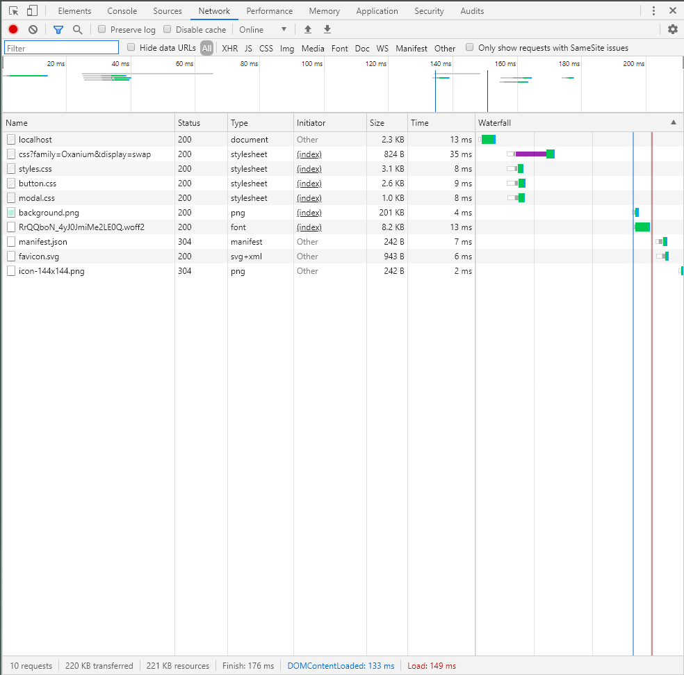
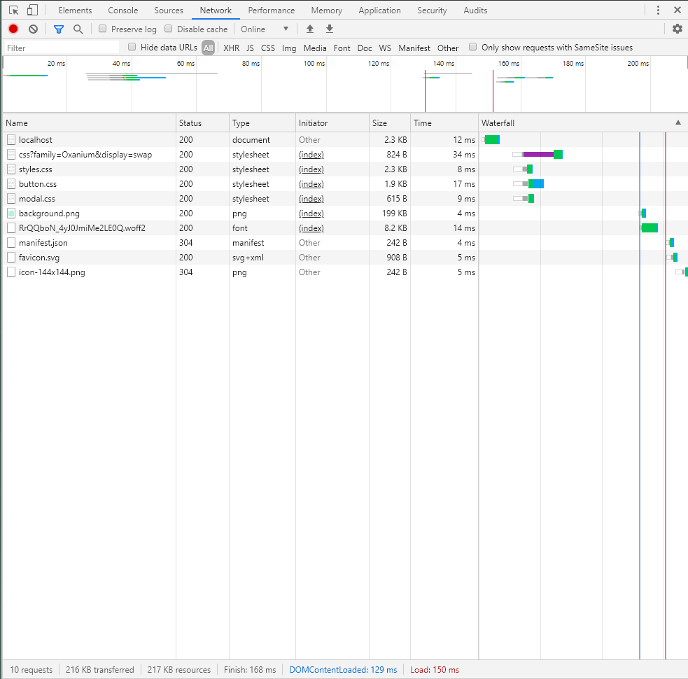
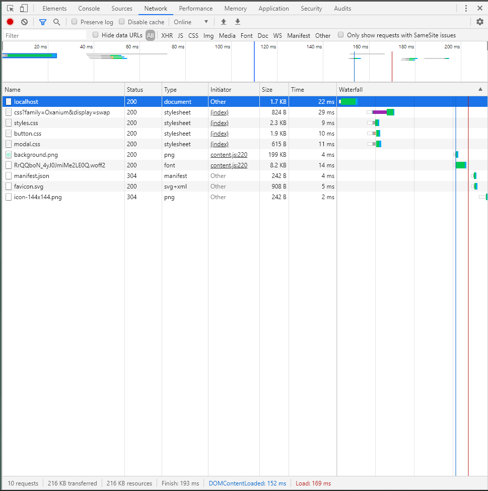
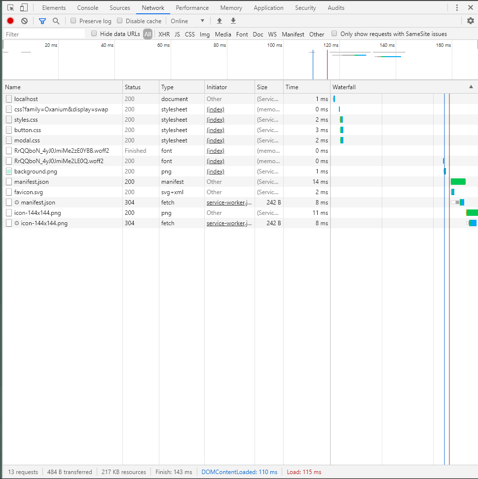
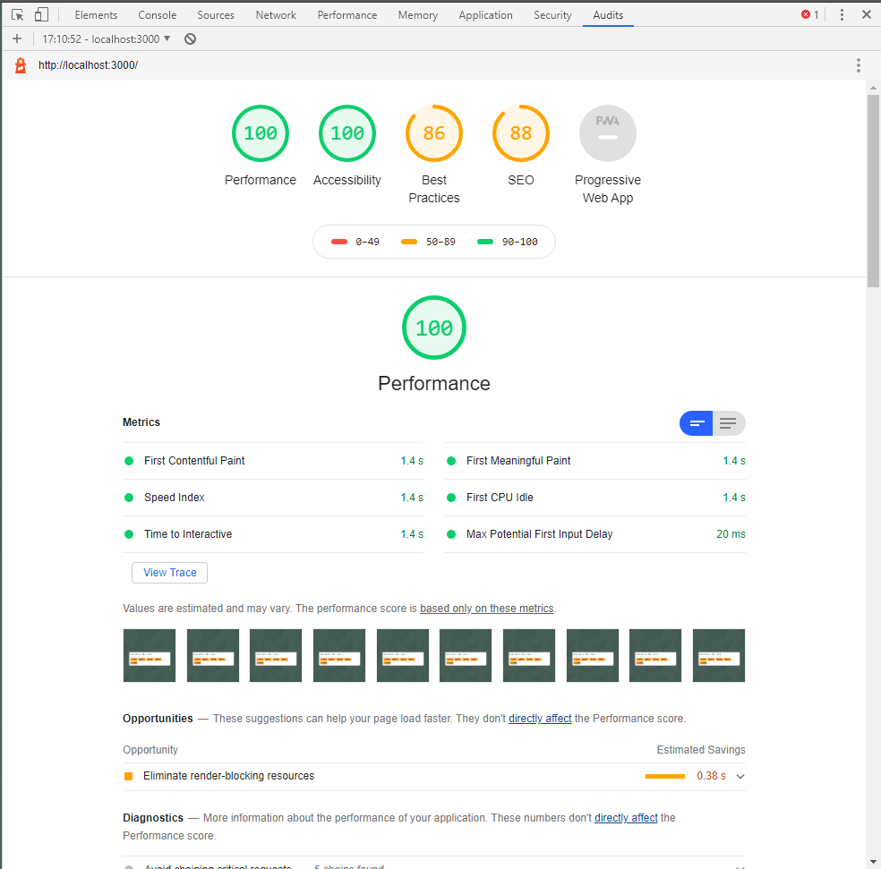
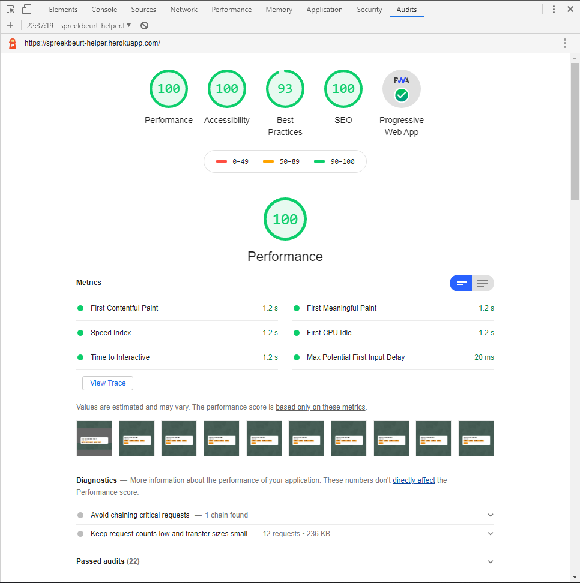

# Progressive Web Apps 
This project is based on a project for OBA: https://github.com/tnanhekhan/project-1-1920  

  

## Table of Contents
1. [Installation](#installation)
2. [Usage](#usage)
3. [Live Version](#live-version)
4. [Job Stories](#job-stories)
5. [Feedback Week 2](#feedback-week-2)
6. [Performance Enhancement](#performance-enhancement)  
7. [Built with](#built-with)

## Installation  
Clone this repo with your favourite GIT CLI or GUI.  
CD to this project folder.  
Run ` npm install ` to install this project and its necessary dependencies.  
Run ` npm build ` to build this project.

## Usage
Run `npm dev` and go to `localhost:3000` to see the dev version with nodemon development server.  
Run `npm start` and go to `localhost:3000` to see the normal version running.

## Live Version
Here is the live version hosted on Heroku: https://spreekbeurt-helper.herokuapp.com/

## Job Stories
- When I am offline, i want to be notified by the app that i am offline so that I know I need to enable internet
- When I open the app, i want to be able to install the app so I have a progressive web app experience

## Feedback Week 2
Feedback over:
- Project structuur
- Api calls

## Performance Enhancement
### Minified CSS and Images
With the help of the gulp scripts `gulp-clean-css` and `gulp-imagemin` I have minified the css and images the app uses. The images show the size difference in the network tab of chrome dev tools. The total size decrease is 4kb or around 1.81% in this case. The load time however is somehow 1 ms longer on the version with the minified assets

Before:  

After: 

### Minified HTML
With the npm dependency `express-minify-html` you can minify the views the express render method uses. The minified HTML version it's localhost html file is 0.6 kb smaller than the non-minified version.  

No Minified HTML: 

Minified HTML: 

### Service Worker Caching
One of the requirements of this exercise is that we had to implement a service worker which caches some assets and shows an offline page. The images show below the time it takes to load the page. The version with the implemented service worker loads the page 35 ms (or 23%) faster than the version without a service worker. The transferred size has also decreased by  ~215 kb.

No Service Worker:  

With Service Worker: 

### Loading CSS Async
This project had three css files which I combined into one file. The problem was that css files are render-blocking. To prevent this the css needs to be loaded asynchronously. 

### Audit Results
The audit after the performance enhancement is a bit slower because it is deployed on a live environment instead of a local environment. Other than Search Engine Optimization all audit scores are higher after the performance enhancement.

Audit before Performance Enhancement:  

Audit after Performance Enhancement: 

### Conclusion
The enhancements have an positive effect on file sizes and load times. However because the project and it's assets are so small in size, the effect is barely noticable. 
With the minify for example the first meaningful paint improves with just 35 ms, which is barely noticeable but an improvement anyway. If this would project would be larger the performance enhancement would be more noticeable.

## Built with
- [Node.js](https://nodejs.org/en/): A JavaScript runtime built on Chrome's V8 JavaScript engine.
- [Express.js](https://expressjs.com/): A minimal and flexible Node.js web application framework that provides a robust set of features for web and mobile applications.
- [EJS](https://ejs.co/): Embedded JavaScript templating.
- [Axios](https://github.com/axios/axios): Promise based HTTP client for the browser and node.js
- [Nodemon](https://nodemon.io/): An utility that will monitor for any changes in your source and automatically restart your server.

